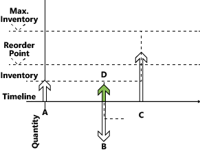

# Dettagli di progettazione: Gestione giacenze negative previste
Il punto di riordino esprime la domanda prevista durante il lead time dell'articolo. Quando il punto di riordino viene superato, è tempo di ordinare quantità maggiori. Ma le scorte previste devono essere abbastanza grandi da coprire la domanda fino a che non viene ricevuto il nuovo ordine. Nel frattempo, la scorta di sicurezza deve coprire le fluttuazioni della domanda fino a un livello di servizio di destinazione.  

 Di conseguenza, se una domanda futura non può essere servita dalle scorte previste, oppure espressa in un altro modo, il sistema di pianificazione considera un'emergenza se la giacenza disponibile diventa negativa. Il sistema tratta questo tipo di eccezione suggerendo un nuovo ordine di approvvigionamento in modo da soddisfare la parte della domanda che non può essere soddisfatta dal magazzino o da un altro approvvigionamento. Le dimensioni dell'ordine del nuovo ordine di approvvigionamento non prenderanno in considerazione la giacenza massima o la quantità di riordino, né prenderanno in considerazione i modificatori di ordine Quantità massima ordine, Quantità minima ordine e Molteplicità ordine. In alternativa, rifletterà la carenza esatta.  

 Nella riga di pianificazione per questo tipo ordine di approvvigionamento verrà visualizzata un'icona di avviso di emergenza. Verranno inoltre fornite informazioni aggiuntive su ricerca per informare l'utente della situazione.  

 Nella seguente illustrazione l'approvvigionamento D rappresenta un ordine di emergenza per la rettifica della giacenza negativa.  

   

1.  L'approvvigionamento **A**, la giacenza disponibile iniziale, è inferiore al punto di riordino.  

2.  Viene creato un nuovo approvvigionamento programmato in avanti (**C**).  

     (Quantità = Giacenza massima – Livello giacenza disponibile)  

3.  L'approvvigionamento **A** viene chiuso dalla domanda **B**, che non viene coperta completamente.  

     La domanda **B** potrebbe provare a pianificare l'Approvvigionamento C ma ciò non accade in base al concetto dell'intervallo di tempo.  

4.  Un nuovo approvvigionamento (**D**) viene creato per coprire la quantità residua sulla domanda **B**.  

5.  La domanda **B** viene chiusa creando un sollecito alle scorte previste.  

6.  Il nuovo approvvigionamento **D** viene chiuso.  

7.  La giacenza disponibile è controllata; il punto di riordino non è stato superato.  

8.  L'approvvigionamento **C** viene chiuso (non esiste più la domanda).  

9. Controllo finale: non esistono solleciti di livello di magazzino in sospeso.  

> [!NOTE]  
>  Il passaggio 4 indica in che modo il sistema opera nelle versioni precedenti a Microsoft Dynamics NAV 2009 SP1.  

 Ciò conclude la descrizione dei principi centrali relativi alla pianificazione del magazzino basata sui metodi di riordino. Nella seguente sezione vengono illustrate le caratteristiche dei quattro metodi di riordino supportati.  

## Vedi anche  
 [Dettagli di progettazione: Criteri di riordino](design-details-reordering-policies.md)   
 [Dettagli di progettazione: Parametri di pianificazione](design-details-planning-parameters.md)   
 [Dettagli di progettazione: Gestione dei metodi di riordino](design-details-handling-reordering-policies.md)   
 [Dettagli di progettazione: Pianificazione approvvigionamento](design-details-supply-planning.md)

